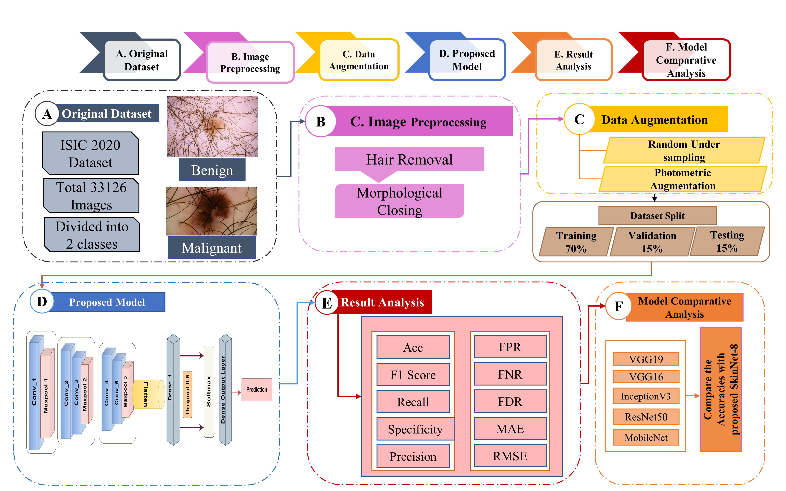

# SkinNet-8: An Efficient CNN Architecture for Classifying Skin Cancer on an Imbalanced Dataset

📚 This repository contains the original implementation of SkinNet-8: An Efficient CNN Architecture for Classifying Skin Cancer on an Imbalanced Dataset.

📧 **Contact**: For inquiries, you can reach out to us at <span style="color:blue">m.raiaan.cs@gmail.com</span>.

## Research Paper

📄 This code implements the paper published in a SCOPUS INDEX CONFERENCE, 2023 International Conference on Electrical, Computer and Communication Engineering (ECCE)

**Title**: [SkinNet-8: An Efficient CNN Architecture for Classifying Skin Cancer on an Imbalanced Dataset](https://ieeexplore.ieee.org/abstract/document/10101527)

**Authors**: Nur Mohammad Fahad; Sadman Sakib; Mohaimenul Azam Khan Raiaan; Md. Saddam Hossain Mukta

**Year**: 2023

**DOI**: [10.1109/ECCE57851.2023.10101527](https://doi.org/10.1109/ECCE57851.2023.10101527)

## Dataset Availability

This project uses the following dataset for Skin Cancer Images:

- [ISIC Challenge Dataset](https://challenge.isic-archive.com/data/#2020)

## Code

You can find the implementation of SkinNet-8 in the following file:

- [RetNet-10 Model.py](Model/SkinNet-8%Skin%Cancer%Classification.ipynb)

## Paper Framework

🖼️ **PIPELINE**:



## Citation Request

If you find this work helpful for your research, please consider citing our paper:
   - Cite:
     ```bibtex
     @INPROCEEDINGS{10101527,
       author={Fahad, Nur Mohammad and Sakib, Sadman and Khan Raiaan, Mohaimenul Azam and Hossain Mukta, Md. Saddam},
       booktitle={2023 International Conference on Electrical, Computer and Communication Engineering (ECCE)},
       title={SkinNet-8: An Efficient CNN Architecture for Classifying Skin Cancer on an Imbalanced Dataset},
       year={2023},
       volume={},
       number={},
       pages={1-6},
       doi={10.1109/ECCE57851.2023.10101527}
     }
     ```

## Copying

This code is shared for research use only. If you encounter any issues or find inappropriate content in this code, please feel free to contact us.

